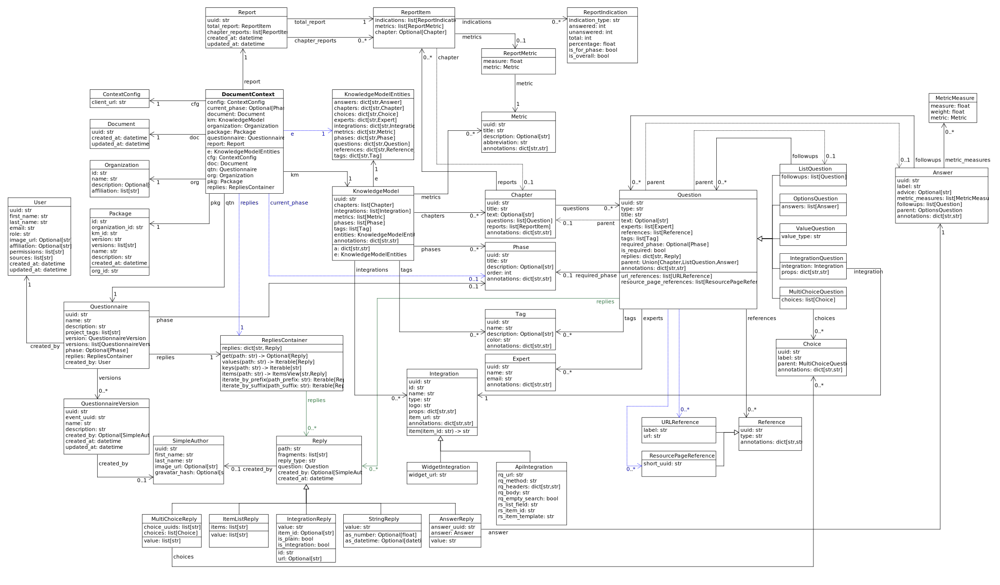

# Document Context

This document describes the structure of document context provided by the Document Worker to the Jinja templates. Currently, the root object of [DocumentContext](#documentcontext) must be created like this:

```jinja

```

* All data types are using Python, e.g., `str` is textual string, `Optional[str]` is a string or `None`, `list[str]` is a list of strings.
* We use `snake_case` for naming of attributes and variables, `PascalCase` is used for class names.
* `datetime` is the standard [`datetime.datetime`](https://docs.python.org/3/library/datetime.html#datetime-objects).
* You can investigate the [`context`](../document_worker/model/context.py) module; however, constructs that are not documented here may change in any version without an explicit notice.

## Diagram

We provide the structure visualized on a class diagram: [SVG](./diagrams/dsw-document-context.svg).

[](./diagrams/dsw-document-context.svg)

## Entities

Here is an interlinked description of each entity and its attributes and links. There are also *aliases* that are convenient shorthands to make template more concise.

### DocumentContext

* `config` ([`ContextConfig`](#contextconfig))
* `current_phase` (`Optional[`[`Phase`](#phase)`]`)
* `document` ([`Document`](#document))
* `km` ([`KnowledgeModel`](#knowledgemodel))
* `organization` ([`Organization`](#organization))
* `package` ([`Package`](#package))
* `questionnaire` ([`Questionnaire`](#questionnaire))
* `report` ([`Report`](#report))

Aliases:

* `e` ([`KnowledgeModelEntities`](#knowledgemodelentities)) - same as `km.entities`
* `doc` ([`Document`](#document)) - same as `document`
* `org` ([`Organization`](#organization)) - same as `organization`
* `pkg` ([`Package`](#package)) - same as `package`
* `qtn` ([`Questionnaire`](#questionnaire)) - same as `questionnaire`
* `replies` ([`RepliesContainer`](#repliescontainer)) - same as `questionnaire.replies`

### ContextConfig

* `client_url` (`str`) - base URL of the DSW instance (client app)

### Document

* `uuid` (`str`)
* `created_at` (`datetime`)
* `updated_at` (`datetime`)

### Organization

* `id` (`str`)
* `name` (`str`)
* `description` (`Optional[str]`)
* `affiliations` (`list[str]`)

### Package

* `id` (`str`) - full ID of KM Package
* `organization_id` (`str`)
* `km_id` (`str`)
* `version` (`str`)
* `versions` (`list[str]`)
* `name` (`str`)
* `description` (`Optional[str]`)
* `created_at` (`datetime`)

### Questionnaire

* `uuid` (`str`)
* `name` (`str`)
* `version` (`Optional[`[`QuestionnaireVersion`](#questionnaireversion)`]`)
* `versions` (`list[`[`QuestionnaireVersion`](#questionnaireversion)`]`)
* `phase` (`Optional[`[`Phase`](#phase)`]`)
* `replies` ([`RepliesContainer`](#repliescontainer))
* `created_by` ([`User`](#user))

### QuestionnaireVersion

* `uuid` (`str`)
* `event_uuid` (`str`)
* `name` (`str`)
* `description` (`Optional[str]`)
* `created_by` ([`SimpleAuthor`](#simpleauthor))
* `created_at` (`datetime`)
* `updated_at` (`datetime`)

### User

* `uuid` (`str`)
* `first_name` (`str`)
* `last_name` (`str`)
* `email` (`str`)
* `role` (`str`) - one of: `admin`, `dataSteward`, `researcher`
* `image_url` (`Optional[str]`)
* `affiliation` (`Optional[str]`)
* `permissions` (`list[str]`)
* `sources` (`list[str]`)
* `created_at` (`datetime`)
* `updated_at` (`datetime`)

### SimpleAuthor

* `uuid` (`str`)
* `first_name` (`str`)
* `last_name` (`str`)
* `image_url` (`Optional[str]`)
* `gravatar_hash` (`Optional[str]`)

### Report

* `uuid` (`str`)
* `total_report` ([`ReportItem`](#reportitem))
* `chapter_reports` (`list[`[`ReportItem`](#reportitem)`]`)
* `created_at` (`datetime`)
* `updated_at` (`datetime`)

#### ReportItem

* `indications` (`list[`[`ReportIndication`](#reportindication)`]`)
* `metrics` (`list[`[`ReportMetric`](#reportmetric)`]`)
* `chapter` (`Optional[`[`Chapter`](#chapter)`]`) - set if it is a chapter report

#### ReportIndication

* `indication_type` (`str`) - one of: `PhasesAnsweredIndication`, `AnsweredIndication` (use alias)
* `answered` (`int`) - number of answered questions
* `unanswered` (`int`) - number of unanswered questions

Aliases:

* `total` (`int`) - `answered` + `unanswered`
* `percentage` (`float`) - `answered` / `total` (handles zero division, number between `0.0` and `1.0`)
* `is_for_phase` (`bool`) - if it is a phase-related indication
* `is_overall` (`bool`) - if it is an overall indication (not phase-related)

#### ReportMetric

* `measure` (`float`) - number between `0.0` and `1.0`
* `metric` ([`Metric`](#metric))

### KnowledgeModel

* `uuid` (`str`)
* `annotations` (`dict[str,str]`)
* `entities` ([`KnowledgeModelEntities`](#knowledgemodelentities))
* `chapters` (`list[`[`Chapter`](#chapter)`]`)
* `integrations` (`list[`[`Integration`](#integration)`]`)
* `metrics` (`list[`[`Metric`](#metric)`]`)
* `phases` (`list[`[`Phase`](#phase)`]`)
* `tags` (`list[`[`Tag`](#tag)`]`)

Aliases:

* `e` ([`KnowledgeModelEntities`](#knowledgemodelentities)) - same as `entities`
* `a` (`dict[str,str]`) - same as `annotations`

:bulb: Equality of all KM entities is being done using the `uuid` comparison under the hood.

:bulb: All KM entities that have `annotations` have also the `a` alias.

#### KnowledgeModelEntities

Container holding all types of Knowledge Model entities within UUID-key dictionaries:

* `answers` (`dict[str,`[`Answer`](#answer)`]`)
* `chapter` (`dict[str,`[`Chapter`](#chapter)`]`)
* `choices` (`dict[str,`[`Choice`](#choice)`]`)
* `experts` (`dict[str,`[`Expert`](#expert)`]`)
* `integrations` (`dict[str,`[`Integration`](#integration)`]`)
* `metrics` (`dict[str,`[`Metric`](#metric)`]`)
* `phases` (`dict[str,`[`Phase`](#phase)`]`)
* `questions` (`dict[str,`[`Question`](#question)`]`)
* `references` (`dict[str,`[`Reference`](#reference)`]`)
* `tags` (`dict[str,`[`Tag`](#tag)`]`)

#### Chapter

* `uuid` (`str`)
* `title` (`str`)
* `text` (`Optional[str]`) - possibly Markdown text
* `questions` (`list[`[`Question`](#question)`]`)
* `reports` (`list[`[`ReportItem`](#reportitem)`]`)
* `annotations` (`dict[str,str]`)

#### Question

Superclass with common attributes for all types of questions. You always get a more specific one and never just a `Question`.

* `uuid` (`str`)
* `type` (`str`)
* `title` (`str`)
* `text` (`Optional[str]`)
* `required_phase` (`Optional[`[`Phase`](#phase)`]`)
* `is_required` (`bool`) - if the question is required in the current phase
* `replies` (`dict[str,`[`Reply`](#reply)`]`) - path-key dictionary of replies to the question
* `experts` (`list[`[`Expert`](#expert)`]`)
* `references` (`list[`[`Reference`](#reference)`]`)
* `tags` (`list[`[`Tag`](#tag)`]`)
* `parent` (`Union[`[`Chapter`](#chapter)`,`[`ListQuestion`](#listquestion)`,`[`Answer`](#answer)`]`)
* `annotations` (`dict[str,str]`)

Aliases:

* `url_references` (`list[`[`URLReference`](#urlreference)`]`)
* `resource_page_references` (`list[`[`ResourcePageReference`](#resourcepagereference)`]`)

:bulb: Parent of a question can be of multiple kinds, you may use the `of_type` test to check what it is if needed.

##### ValueQuestion

* `value_type` (`str`) - type of value, use alias

Aliases:

* `is_string` (`bool`)
* `is_text` (`bool`)
* `is_number` (`bool`)
* `is_date` (`bool`)

##### IntegrationQuestion

* `integration` ([`Integration`](#integration))
* `props` (`dict[str,str]`)

##### OptionsQuestion

* `answers` (`list[`[`Answer`](#answer)`]`)

##### MultiChoiceQuestion

* `choices` (`list[`[`Choice`](#choice)`]`)

##### ListQuestion

* `followups` (`list[`[`Question`](#question)`]`)

#### Answer

* `uuid` (`str`)
* `label` (`str`)
* `advice` (`Optional[str]`) - possibly Markdown text
* `metric_measures` (`list[`[`MetricMeasure`](#metricmeasure)`]`)
* `followups` (`list[`[`Question`](#question)`]`)
* `parent` ([`OptionsQuestion`](#optionsquestion))
* `annotations` (`dict[str,str]`)

##### MetricMeasure

Indication of how an answer affects a certain metric.

* `measure` (`float`) - value between `0.0` and `1.0` (inclusive)
* `weight` (`float`) - value between `0.0` and `1.0` (inclusive)
* `metric` ([`Metric`](#metric))

#### Choice

* `uuid` (`str`)
* `label` (`str`)
* `parent` ([`MultiChoiceQuestion`](#multichoicequestion))
* `annotations` (`dict[str,str]`)

#### Expert

* `uuid` (`str`)
* `name` (`str`)
* `email` (`str`)
* `annotations` (`dict[str,str]`)

#### Reference

As for the [`Question`](#question) class, `Reference` is also a superclass and you will always get an object of its subclass.

* `uuid` (`str`)
* `type` (`str`)
* `annotations` (`dict[str,str]`)

##### URLReference

* `label` (`str`)
* `url` (`str`)

##### ResourcePageReference

* `short_uuid` (`str`)
* `url` (`str`) - URL composed using `client_url` from [`ContextConfig`](#contextconfig)

#### Metric

* `uuid` (`str`)
* `title` (`str`)
* `abbreviation` (`str`)
* `description` (`Optional[str]`) - possibly Markdown text
* `annotations` (`dict[str,str]`)

#### Phase

* `uuid` (`str`)
* `title` (`str`)
* `description` (`Optional[str]`) - possibly Markdown text
* `order` (`int`) - order of the phase within the KM
* `annotations` (`dict[str,str]`)

#### Integration

* `uuid` (`str`)
* `id` (`str`)
* `name` (`str`)
* `item_url` (`str`)
* `logo` (`str`)
* `props` (`dict[str,str]`)
* `rq_method` (`str`)
* `rq_url` (`str`)
* `rq_headers` (`dict[str,str]`)
* `rq_body` (`str`)
* `rs_list_field` (`str`)
* `rs_item_id` (`str`)
* `rs_item_template` (`str`)
* `annotations` (`dict[str,str]`)

Operations:

* `item(item_id: str) -> str` - URL of an item identified by string ID

#### Tag

* `uuid` (`str`)
* `name` (`str`)
* `description` (`Optional[str]`) - possibly Markdown text
* `color` (`str`)
* `annotations` (`dict[str,str]`)

### RepliesContainer

Wrapper around a path-key dictionary of replies.

* `replies` (`dict[str,`[`Reply`](#reply)`]`)

Operations:

* `X[path: str]` (`Optional[`[`Reply`](#reply)`]`) - you can get a reply using square brackets
* `len(X)` (`int`) - number of replies in the container
* `get(path: str) -> Optional[`[`Reply`](#reply)`]`
* `iterate_by_prefix(path_prefix: str) -> Iterable[`[`Reply`](#reply)`]` - *O(n)* iteration with filter
* `iterate_by_suffix(path_suffix: str) -> Iterable[`[`Reply`](#reply)`]` - *O(n)* iteration with filter
* `values() -> Iterable[`[`Reply`](#reply)`]`
* `keys() -> Iterable[str]`
* `items() -> ItemsView[str,`[`Reply`](#reply)`]`

### Reply

Superclass with common attributes for all types of replies. You always get a more specific one and never just a `Reply`.

* `path` (`str`)
* `fragments` (`list[str]`) - UUIDs of the path (starting with chapter)
* `type` (`str`)
* `created_at` (`datetime`)
* `created_by` ([`SimpleAuthor`](#simpleauthor))
* `question` ([`Question`](#question)) - you can assume more specific type of `Question` based on a type of `Reply`

#### AnswerReply

* `answer` ([`Answer`](#answer)) - selected answer as the option

Aliases:

* `value` (`str`) - UUID of the answer (`answer.uuid`)

:bulb: `question` is always [`OptionsQuestion`](#optionsquestion)

#### MultiChoiceReply

* `choices` (`list[`[`Choice`](#choice)`]`) - selected answer as the option

Aliases:

* `value` (`list[str]`) - list of UUIDs of the choices

:bulb: `question` is always [`OptionsQuestion`](#optionsquestion)

:bulb: You can iterate directly over reply object (`for choice in reply`)

#### StringReply

* `value` (`str`)

Aliases:

* `as_number` (`Optional[float]`) - tries to cast the value to a number
* `as_datetime` (`Optional[datetime]`) - tries to cast the value to a timestamp

:bulb: `question` is always [`ValueQuestion`](#valuequestion)

#### ItemListReply

* `items` (`list[str]`) - list of item UUIDs (used in reply paths)

Aliases:

* `value` (`list[str]`) - same as `items`

:bulb: `question` is always [`ListQuestion`](#listquestion)

:bulb: You can iterate directly over reply object (`for item in reply`)

#### IntegrationReply

* `value` (`str`)
* `item_id` (`item_id`) - ID of item if selected using [`Integration`](#integration)

Aliases:

* `id` (`str`) - same as `item_id`
* `is_plain` (`bool`) - entered by user ignoring the integration
* `is_integration` (`bool`) - selected by user using the integration
* `url` (`Optional[str]`) - item URL based [`Integration`](#integration) if selected from it

## Examples

*TBD*

## Important Notes

* The variable `ctx` is still the JSON-like document context provided from DSW described by the [JSON Schema](https://github.com/ds-wizard/dsw-schemas); from `v3.6.0` that will be changed and `ctx` will be an object of [`DocumentContext`](#documentcontext). For compatibility, the plain context will be also supplied with other name.
* For deprecation warnings, search for `DEPRECATED` in this document.
* If you think that something useful is missing in the context or its documentation, please let us know.

This document has been last revised for **DSW Document Worker v3.4.0**.
